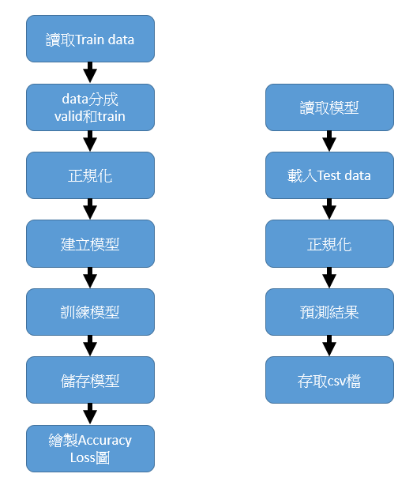
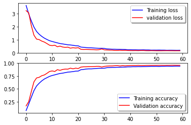

# The Simpsons Characters Recognition Challenge

# 目標
訓練一個能辨認以下50個The Simpsons影集角色的 Convolutional Neural Network (CNN)。

# 環境
* python: 3.7  
* tensorflow: 2.7.0 
* matplotlib: 3.2.2  
* numpy: 1.19.5  
* pandas: 1.1.5  
* keras: 2.7.0  
* use colab compile 

# 整體流程圖

# 結果

